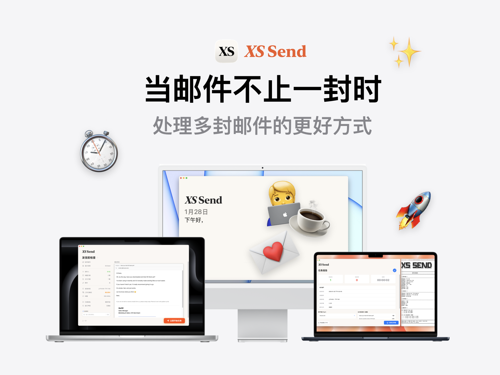
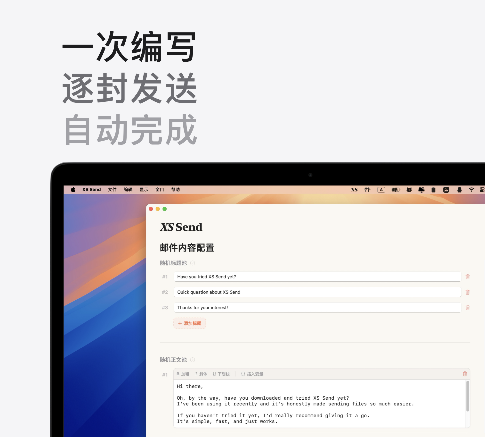

  

<h1 align="center">XS Send</h1>

  <strong>当你需要发送的不止一封邮件时，这是更合适的方式。</strong> 
  用批量的效率，完成一对一的沟通。

  
  
  
  

  <a href="#features">功能</a>&nbsp;&nbsp;•&nbsp;&nbsp;
  <a href="#audience">适用场景</a>&nbsp;&nbsp;•&nbsp;&nbsp;
  <a href="#download">下载</a>&nbsp;&nbsp;•&nbsp;&nbsp;
  <a href="#qa">常见问题</a>

---

**XS Send** 是一款专为 macOS 打造的本地邮件发送工具，用来解决一个很现实的问题：

> 当收件人很多时，如何既不显得在群发，又不消耗你的时间和精力。

你只需要准备一封模板和一份联系人列表，其余的事情交给 XS Send。  
它会自动为每一位收件人生成并发送独立邮件。整个过程无需值守，也不需要你反复确认和操作。

---

## 功能

### 把群发，变成一对一

通过变量系统，将表格中的数据直接嵌入邮件正文，例如 `{name}`、`{company}`、`{position}`。

- 支持任意自定义变量
- 导入 Excel 时自动匹配表头
- 发送前可预览最终邮件模拟界面

  

  <em>一次配置标题与正文模板池，XS Send 会为每位收件人随机生成并发送独立邮件。</em>

### 一次设置，自动完成

XS Send 会按照你的配置，自动、顺序地完成所有发送任务。

- 无需人工干预
- 即使收件人数量达到上千，也能稳定执行
- 你可以把时间留给真正重要的事情

### 原生、轻量的 macOS 应用
XS Send 遵循 macOS 的系统设计规范，界面简洁直接，不打扰。

- 支持深色模式
- 支持系统级菜单栏和设置
- 安装包体积小，占用资源低
- 启动快，用完即走

### 本地运行，隐私优先
应用以本地化为设计前提。

- 不依赖后端服务器
- 邮件直接通过你配置的 SMTP 服务器发送
- 邮箱密码安全存储在 macOS 钥匙串中

---

## 适用场景

**销售或商务拓展**  
面对大量潜在客户时，不必反复操作，也不必盯着进度。一次配置，自动完成触达。

**求职或学术申请**  
批量发送简历或申请邮件，但每一封都能针对不同公司或导师进行定制。

**独立开发者与自由职业者**  
向用户发送更新通知、测试邀请或维护性沟通，过程轻量、省心。

---

## 下载与安装

前往 GitHub Releases 页面下载最新版本的 `.dmg` 文件：

👉 [https://github.com/xindisuen/xs-send/releases](https://github.com/xindisuen/xs-send/releases)

### 国内用户
如果 GitHub 下载较慢，可以使用以下备用链接：

👉 123 云盘：https://www.123865.com/s/Cfr8jv-AD6aH?pwd=SEND\#

---

## 常见问题

**无法打开，提示“无法验证开发者”？**  
这是因为应用未进行 Apple 公证，不影响安全性。  
在 Finder 中右键点击应用，选择“打开”，在弹窗中再次确认即可。只需操作一次。

**邮件发送失败，提示认证错误？**  
部分邮箱服务需要使用“应用专用密码”而不是登录密码。  
请在邮箱设置中开启 SMTP 并生成专用密码后再试。

---

## 隐私说明

XS Send 以本地优先为原则设计。

- 不会读取或分析你的邮件内容
- 不会收集联系人信息或邮箱账号
- 仅收集少量匿名使用数据，用于了解功能使用情况和改进产品体验

所有数据均不涉及个人身份，也不会用于广告或第三方共享。

---

Copyright © 2026. All rights reserved.
